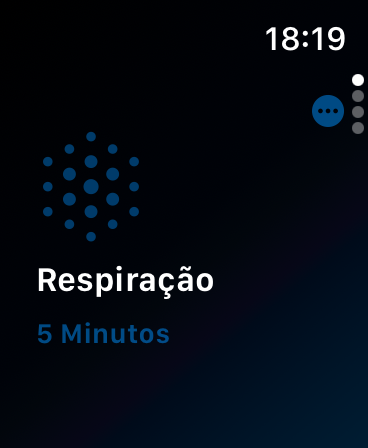
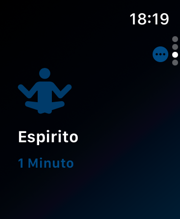
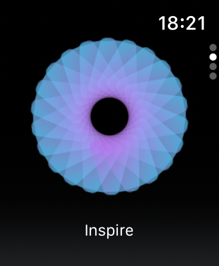
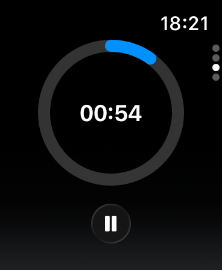
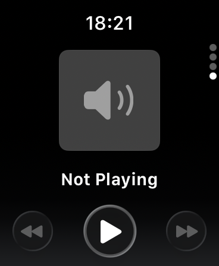
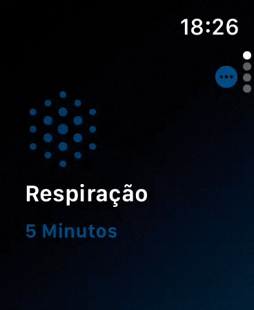

# App Repiração Guiada para Apple Watch
 Domine animações suaves, timers sincronizados e recursos hápticos para entregar experiências que realmente impactam o bem-estar do usuário - tudo com foco em performance e acessibilidade no pulso.
 
  ### Projeto desenvolvido ultilizando:
  - [x] Apple Watch.
  - [x] Swift 6.
  - [x] MVVM.
  - [x] SwiftUI.
  - [x] Animações.
  - [x] Persistência local usando `UserDefaults`.
  - [x] Curso utilizado do `iOSLab` [https://ioslab.co/] .
  
 ## Print Screen :foggy:
 
|  |  |  |
|:---:|:---:|:---:|
| Respiração | Reflexão | Espiríto |

|  |  |  |
|:---:|:---:|:---:|
| Inspira/Expira | Timer | Player |

## Gif :space_invader:

|  |
|:---:|
| Respiração Guiada |

### :point_up: Créditos Professor: 

:rocket: Gustavo Cosme [https://gustavocosme.myportfolio.com]
